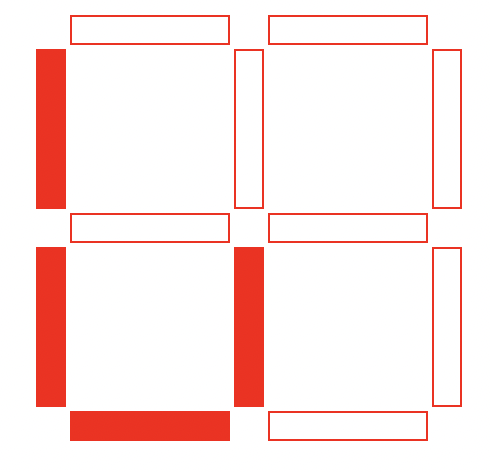
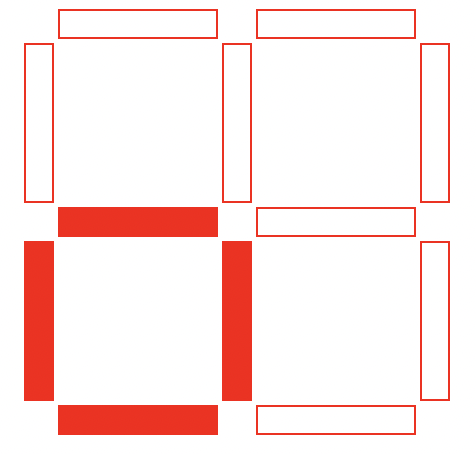
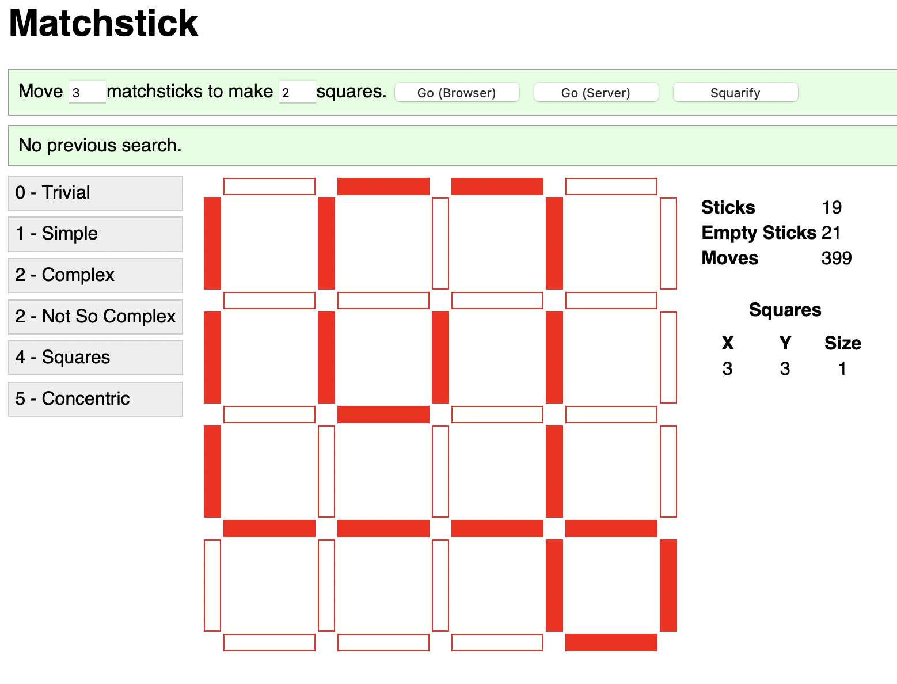

# react-matchstick

This is a JavaScript and React based solver for certain
[matchstick puzzles.](https://matchstickpuzzles.net). The puzzles this
can solve are played on a rectangular grid and solved by moving a fixed
number of matches from one location to another to produce a layout
with a specific number of squares 

A simple starting board with four matches might look like this. For
this puzzle, the goal is to move one match to configure the matches so
that there is a single square:

With one matchstick moved into the correct position, the solved board
looks like this:

Other puzzles have bigger boards, more matches, and allow more matches
to be moved to reach a larger number of desired squares:

# General Design

This is written using the webpack development server to present a
fully client side UI written using React and SASS.

The [board data structure and solver](common/MatchstickModel.js#L263)
are located in a common module that's run both in the client code and
within the webpack server. The server side instance of the solver is
exposed to the client over an [endpoint](/server/app.js#L25) that
accepts a serialized JSON representation of a board and returns a
solution.  This allows the same solver code to be run within two
JavaScript implementations with the same UI.

This software was initially built using a version of React that
predates hooks, so there are at least a few old-style React component
definitions.

# The C version

There's also a [native solver written in C](native/matchstick.c).
This version is faster, although it's not integrated with the
JavaScript and lacks anything resembling a resonable user interface.

# Potential Futures

Every software project has directions it could go, given somebody
willing to invest the time to take it there. This project is no
exception. If you happen to run across this repository and are looking
for ways to play around with this code, here are a few ideas that come
to mind. I've roughly ordered them in what I believe to be ascending
order of challenge.

* Add a suite of tests.
* Update the use of React to a more current idiomatic style (hooks, etc.)
* Add a way to edit, save, and load puzzle definitions. (The current
  presets are defined in code, and are fixed.)
* Break out a profiler and tune the performance of the solver. It's
  currently written to be fast enough to allow the preset puzzles to
  be solved in the context of a live demo, but there's a lot of
  potential left on the table.
* Experiment with different front end libraries entirely. (Vue, etc.)
* Integrate the C solver into the JavaScript codebase somehow.
* Extend the solver in a way that allows it to be used for
  non-rectangular arrangements of matchsticks. (The link above
  contains a number of examples.)

